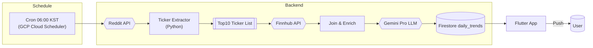

# 📰 today-meme-news

> "미국 밈 주식 커뮤니티의 열기를, 아침마다 한눈에"

**today‑meme‑news** 는 미국 주식 커뮤니티( **Reddit – r/wallstreetbets, r/investing, r/stocks** 등)에서 전날 가장 많이 언급된 **밈 종목(티커)** 과 주요 이슈를 자동 수집하고, 대형 언어 모델(LLM)로 요약·감정 분석하여 **한국 사용자**에게 매일 아침 브리핑 형태로 전달하는 서비스입니다.

---

## 🧠 기획 의도

| Pain Point                              | Insight                                           |
| --------------------------------------- | ------------------------------------------------- |
| 시차·언어 장벽으로 전날 미국 커뮤니티 이슈를 실시간 파악하기 어려움  | "아침 한 번 스크롤로 전날 밈 종목 트렌드 전체를 보고 싶다"               |
| 뉴스는 많지만 **커뮤니티 여론·감정 변화**까지 보여주는 서비스 부족 | "가장 시끄러운 티커 + 커뮤니티 분위기 ↔ 주가"를 함께 보여주면 정보‑재미 동시 충족 |
| 실시간 가격 데이터는 유료·복잡                       | 전날 종가/변동률만으로도 밈 트렌드 파악 가능 → **하루 1회 캐싱** 전략       |

---

## 🎯 핵심 기능

### 1️⃣ 커뮤니티 데이터 수집

* **Reddit API** (`r/wallstreetbets`, `r/investing`, `r/stocks`)
* 24시간 내 게시글·댓글에서 티커 패턴(\$?\[A-Z]{1,5}) 추출 → 언급량 집계
* 상위 10개 티커 & 대표 게시글 링크 수집

### 2️⃣ AI 요약·감정 분석

* Google **Gemini Pro** (또는 OpenAI GPT‑4o) 사용
* 티커별 대표 멘트 3\~5개 요약 → 한글 2줄 요약 생성
* 긍정·부정·중립 감정 스코어 계산

### 3️⃣ 가격 데이터 연동

* **Finnhub 무료 API**
* 전날 종가, 변동률(+/‑ %) 가져와 언급량과 매칭

### 4️⃣ 데이터 캐싱 & 공급

* **Cloud Functions (Node.js) + Firebase Firestore**
* 서울시간 **매일 06:00** 트리거 → 파이프라인 실행 → `daily_trends/{YYYYMMDD}` 컬렉션 저장

### 5️⃣ Flutter 앱 (클라이언트)

* `http` + `flutter_riverpod` 상태 관리
* 카드형 UI (티커 로고, 요약, 감정게이지, 변동률)
* 매일 아침 Push 알림(Firebase Cloud Messaging)

---

## 🔄 데이터 파이프라인 다이어그램 (Mermaid)

---

## 💡 기술 스택

| Layer       | Tech                   | Note                |
| ----------- | ---------------------- | ------------------- |
| Scheduler   | Cloud Scheduler        | 매일 06:00 KST 트리거    |
| ETL         | Python + PRAW (Reddit) | 티커 추출 스크립트          |
| Pricing     | Finnhub API            | 무료 플랜(60req/min) 활용 |
| LLM         | Gemini Pro via REST    | 요약/감정 분석            |
| DB          | Firebase Firestore     | `daily_trends` 컬렉션  |
| Client      | Flutter (Material 3)   | Riverpod, http      |
| Auth & Push | Firebase Auth, FCM     | 익명 로그인 + 알림         |

---

## 📌 백로그 (MVP \~ Beta)

* [ ] Reddit 크롤러 스크립트 완성
* [ ] ETL → Firestore 파이프라인 자동화
* [ ] LLM 프롬프트 최적화: 밈/슬랭 해석 강화
* [ ] Flutter 카드 UI 컴포넌트 구현
* [ ] FCM 일일 Push 알림 배포
* [ ] 내부 사용자 테스트(10명) & 피드백 반영
* [ ] 앱스토어 / 플레이스토어 TestFlight·Internal Track 배포

---

## ✨ Why today‑meme‑news?

> "뉴스보다 재밌고, 소문보다 빠르다"

* 📈 **커뮤니티 언급량 × 주가 변동** 을 한눈에
* 🤖 **AI로 밈·슬랭까지 한국어 2줄 요약**
* ☕ **아침 브리핑**: 출근길 30초면 전날 미국 밈 흐름 파악

---

## 🤝 Contributing / Contact

* PR·Issue 환영! 파이프라인 성능 개선, UI 아이디어 무엇이든 제안해주세요.
* 📧 [gus20102@naver.com](mailto:gus20102@naver.com) / 📱 +82‑10‑5053‑4216
