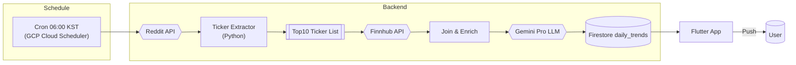

<<<<<<< HEAD
# 📰 today-meme-news

> "미국 밈 주식 커뮤니티의 열기를, 아침마다 한눈에"

**오늘 날짜: 2025년 05월 08일**

**today‑meme‑news** 는 미국 주식 커뮤니티( **Reddit – r/wallstreetbets, r/investing, r/stocks** 등)에서 전날 가장 많이 언급된 **밈 종목(티커)** 과 주요 이슈를 자동 수집하고, 대형 언어 모델(LLM)로 요약·감정 분석하여 **한국 사용자**에게 매일 아침 브리핑 형태로 전달하는 서비스입니다.

---

## 🧠 기획 의도

| Pain Point                              | Insight                                           |
| --------------------------------------- | ------------------------------------------------- |
| 시차·언어 장벽으로 전날 미국 커뮤니티 이슈를 실시간 파악하기 어려움  | "아침 한 번 스크롤로 전날 밈 종목 트렌드 전체를 보고 싶다"               |
| 뉴스는 많지만 **커뮤니티 여론·감정 변화**까지 보여주는 서비스 부족 | "가장 시끄러운 티커 + 커뮤니티 분위기 ↔ 주가"를 함께 보여주면 정보‑재미 동시 충족 |
| 실시간 가격 데이터는 유료·복잡                       | 전날 종가/변동률만으로도 밈 트렌드 파악 가능 → **하루 1회 캐싱** 전략       |

---

## 🎯 핵심 기능

### 1️⃣ 커뮤니티 데이터 수집

* **Reddit API** (`r/wallstreetbets`, `r/investing`, `r/stocks`)
* 24시간 내 게시글·댓글에서 티커 패턴(\$?\[A-Z]{1,5}) 추출 → 언급량 집계
* 상위 10개 티커 & 대표 게시글 링크 수집

### 2️⃣ AI 요약·감정 분석

* Google **Gemini Pro** (또는 OpenAI GPT‑4o) 사용
* 티커별 대표 멘트 3\~5개 요약 → 한글 2줄 요약 생성
* 긍정·부정·중립 감정 스코어 계산

### 3️⃣ 가격 데이터 연동

* **Finnhub 무료 API**
* 전날 종가, 변동률(+/‑ %) 가져와 언급량과 매칭

### 4️⃣ 데이터 캐싱 & 공급

* **Cloud Functions (Node.js) + Firebase Firestore**
* 서울시간 **매일 06:00** 트리거 → 파이프라인 실행 → `daily_trends/{YYYYMMDD}` 컬렉션 저장

### 5️⃣ Flutter 앱 (클라이언트)

* `http` + `flutter_riverpod` 상태 관리
* 카드형 UI (티커 로고, 요약, 감정게이지, 변동률)
* 매일 아침 Push 알림(Firebase Cloud Messaging)

---

## 🔄 데이터 파이프라인 다이어그램 (Mermaid)



---

## 💡 기술 스택

| Layer       | Tech                   | Note                |
| ----------- | ---------------------- | ------------------- |
| Scheduler   | Cloud Scheduler        | 매일 06:00 KST 트리거    |
| ETL         | Python + PRAW (Reddit) | 티커 추출 스크립트          |
| Pricing     | Finnhub API            | 무료 플랜(60req/min) 활용 |
| LLM         | Gemini Pro via REST    | 요약/감정 분석            |
| DB          | Firebase Firestore     | `daily_trends` 컬렉션  |
| Client      | Flutter (Material 3)   | Riverpod, http      |
| Auth & Push | Firebase Auth, FCM     | 익명 로그인 + 알림         |

---

## 📌 백로그 (MVP \~ Beta)

* [ ] Reddit 크롤러 스크립트 완성
* [ ] ETL → Firestore 파이프라인 자동화
* [ ] LLM 프롬프트 최적화: 밈/슬랭 해석 강화
* [ ] Flutter 카드 UI 컴포넌트 구현
* [ ] FCM 일일 Push 알림 배포
* [ ] 내부 사용자 테스트(10명) & 피드백 반영
* [ ] 앱스토어 / 플레이스토어 TestFlight·Internal Track 배포

---

## 🚩 2025.05 기준 최신 구현 현황

### 🎨 UI/디자인 가이드 (2025, 최신)
- **현재는 다크모드만 지원**  
  (라이트모드/시스템 연동은 추후 지원 예정)
- 컬러 팔레트, 카드 스타일, 감정 게이지 등은 기존 가이드와 동일하게 적용
- 주요 색상(Primary, Positive, Negative, Neutral, Accent 등)은 코드에 하드코딩되어 일관성 유지

### 🖥️ 앱 구조 및 기능(2025.05 기준)
- **홈 화면**: 상단에 "마지막 업데이트(07:00)"와 "다음 업데이트(내일 07:00)" 정보 박스,  
  그 아래 날짜별 그룹핑된 10개 카드(2단 그리드, 최대 7일치 무한 스크롤)
- **카드**: 티커/로고, 등락률+감정, 전일 종가, 대표 멘트, 감정 게이지 등 정보 표시
- **상세/설정/온보딩** 등은 추후 구현 예정(현재는 홈 피드 중심)
- **새로고침 버튼**은 상단 박스에서 제거, 데이터는 매일 07:00 기준 자동 갱신

### 🌓 다크/라이트 모드
- 현재는 **다크모드만 지원**  
- 색상값은 코드에 하드코딩되어 있으며, WCAG 명도 대비 기준 충족
- 라이트모드/시스템 연동은 추후 지원 예정

### ✅ 구현 현황
- [x] 홈 피드(날짜별 그룹핑, 카드 10개, 무한 스크롤)
- [x] 상단 정보 박스(마지막/다음 업데이트)
- [x] 카드 UI(티커, 등락률, 감정, 종가, 멘트, 게이지)
- [x] 디자인 가이드 반영(색상, 폰트, 여백 등)
- [ ] 상세/설정/온보딩 등 기타 화면

---

## 🎨 UI 디자인 가이드 (2025)

### 컬러 팔레트
| 역할         | 다크모드                | 라이트모드              | 설명                        |
|------------|---------------------|---------------------|---------------------------|
| Primary    | #00C4FF (Sky Cyan)  | #007ACC (Azure Blue)| 브랜드/포인트 컬러             |
| Surface    | #10151E (Navy)      | #FFFFFF (White)     | 카드/주요 배경                 |
| Positive   | #4CAF50 (Mint Green)| 동일                  | 주가 상승, 긍정 신호             |
| Negative   | #F64E60 (Coral Red) | 동일                  | 주가 하락, 부정 신호             |
| Neutral    | #9CA3AF (Cool Gray) | #6B7280 (Cool Gray) | 보조 텍스트, 중립 신호           |
| Accent     | #FFC400 (Meme Yellow)| #FF8F00 (Amber)    | CTA, 밈 강조, 버튼 등            |
| Background | #0B0F16 (Rich Black)| #F3F4F6 (Gray-50)   | 앱 전체 배경                    |

- **명도 대비**: 텍스트는 Neutral 계열로, WCAG AA 기준 충족

### 스타일 가이드
- **카드**: 16dp 라운드, 4dp 그림자(다크: 30% 투명), 내부 패딩 16dp
- **게이지 바**: Positive→Neutral→Negative 3색 그라디언트, 상단 2px Accent Yellow
- **폰트**: Pretendard/Inter, 제목 700, 본문 500, 숫자/퍼센트는 tabular-nums
- **아이콘**: Lucide-react/Material, 티커 없으면 line-chart/trending-up/down
- **애니메이션**: 카드 진입 fade-in+slide-up(120ms), Shimmer(1000ms)
- **공간**: 4pt 그리드, 카드 간 12dp, SafeArea 24dp

### 화면별 무드
- **홈**: 2단 Masonry 카드, 날짜+🔥, 카드 리스트
- **상세**: 티커 로고+배지, 멘션 speech-bubble, 미니 차트(투명)
- **설정**: Minimal, Accent Yellow 토글, 알림에 🔔

### 다크/라이트 모드
- ThemeMode.system 연동
- Light: 그림자 8% black, Dark: 30% black
- Accent/Positive/Negative는 명도만 조정(라이트+10%, 다크-10%)

### 톤앤매너
> "다크모드 우선의 모던 핀테크 UI에, 밈·게이밍 커뮤니티 느낌을 살짝 얹은 'Fun Bloomberg' 컨셉. 시원한 시안(Primary)을 메인, 상승·하락은 Mint Green/Coral Red, 밈 강조는 Meme Yellow. 카드형 리스트가 주 컨테이너, 16dp 라운드·4dp 쉐도우 기본."

---

## 📱 앱 메뉴 & 주요 기능 설계

### 1. 홈 (Meme Stocks Feed)
- 오늘 날짜 + 🔥 이모지 헤더
- Top 10 밈 종목 카드 리스트 (2단 Masonry Grid)
  - 티커 로고/이니셜, 종목명, 변동률(상승/하락), 감정 게이지, 대표 멘트(요약)
  - 카드 클릭 시 상세로 이동
- 검색/필터 (상단 아이콘)
- 새로고침/데이터 동기화 (Pull to refresh)

### 2. 상세 (종목 딥다이브)
- 티커 로고 + 배지
- 대표 멘트 3~5개 (speech-bubble 스타일)
- 24시간 미니 차트 (투명 배경)
- Reddit 원문 보기 버튼
- 감정 게이지/변동률/종가 등 주요 데이터

### 3. 설정 (Settings)
- 알림 설정 (푸시 알림 on/off, 시간대 설정)
- 다크/라이트 모드 토글
- 앱 정보/버전
- 문의/피드백 (이메일, 오픈채팅 등)

### 4. 기타(옵션)
- 온보딩/튜토리얼 (최초 진입 시)
- 앱 내 공지/업데이트 안내
- 즐겨찾기/관심 종목 (추가 가능)
- 커뮤니티 링크 (Reddit, 트위터 등 외부 이동)

### 🗂️ 메뉴 구조 예시 (탭/드로어 기준)
- 하단 탭바: [홈]  [검색]  [설정]
- 또는 햄버거 드로어: 홈, 즐겨찾기, 설정, 앱 정보

### 📝 기능 요약
| 메뉴      | 주요 기능                                                         |
|---------|----------------------------------------------------------------|
| 홈      | 오늘의 밈 종목 리스트, 카드형 UI, 날짜/검색/새로고침, 상세 진입           |
| 상세     | 종목별 요약, 감정/변동률/차트, 멘트, Reddit 원문, 공유                 |
| 설정     | 알림, 테마, 앱 정보, 피드백                                       |
| 온보딩   | 서비스 소개, 주요 기능 안내, 시작하기 버튼                              |

---

## ✨ Why today‑meme‑news?

> "뉴스보다 재밌고, 소문보다 빠르다"

* 📈 **커뮤니티 언급량 × 주가 변동** 을 한눈에
* 🤖 **AI로 밈·슬랭까지 한국어 2줄 요약**
* ☕ **아침 브리핑**: 출근길 30초면 전날 미국 밈 흐름 파악

---

## 🤝 Contributing / Contact

* PR·Issue 환영! 파이프라인 성능 개선, UI 아이디어 무엇이든 제안해주세요.
* 📧 [gus20102@naver.com](mailto:gus20102@naver.com) / �� +82‑10‑5053‑4216

## 🚀 온보딩 이후 사용자 플로우

| 단계                        | 화면 이름                | 목적                                              | 구현 힌트                                                                                      |
|-----------------------------|--------------------------|---------------------------------------------------|-----------------------------------------------------------------------------------------------|
| **① 시스템 푸시 권한 요청**        | *Native Permission Modal* | 슬라이드 3에서 알림 가치를 설명했으니, 실제 OS 권한을 즉시 요청해 전환율↑    | • `permission_handler` 패키지<br>• iOS는 `requestNotificationPermissions()` 전 호출 시 설명 Alert 필요 |
| **② 관심 티커 선택 (Optional)** | *Pick Favorites*         | 홈 피드 맞춤화 + 초기 빈 화면 방지                           | • 상위 20개 인기 티커 그리드 + 다중 선택<br>• 최소 3개 선택 후 '완료' CTA                                        |
| **③ 초기 데이터 로딩**           | *Splash / Skeleton*      | Firebase(Supabase)-> 캐시 싱크 동안 사용자에게 Progress 전달 | • Shimmer 리스트 2–3초<br>• 서버 오류 시 Retry 버튼                                                   |
| **④ 홈(Top 10) 리스트**       | *HomeFeed*               | 실사용 진입점                                         | • BottomNav(Home·Search·Settings) 노출<br>• 첫 실행 welcome 토스트: "🔥 오늘의 밈 뉴스가 준비됐어요!"          |

---

### 전체 플로우 요약

1. 온보딩 → 2. **시작하기** → 3. **푸시 권한 요청** → 4. **관심 티커 선택** → 5. **초기 데이터 로딩(Shimmer)** → 6. **홈 피드 진입**

- 각 단계는 별도 화면/라우트로 분리
- 관심 티커 선택은 건너뛰기(Skip) 옵션도 고려
- 푸시 권한 거부 시에도 앱 사용은 가능하게 UX 설계

---
=======
# Today Meme News Backend

Reddit의 r/wallstreetbets, r/stocks, r/investing 등에서 수집한 데이터를 처리하고 분석하는 ETL 파이프라인입니다.

## 주요 기능

- Reddit API를 통한 데이터 수집
- 티커 심볼 추출 및 집계
- Finnhub API를 통한 가격 데이터 연동
- Gemini Pro를 통한 요약 및 감정 분석
- Firebase Firestore에 데이터 저장

## 설정 방법

1. Python 3.9 이상 설치
2. 가상환경 생성 및 활성화:
   ```bash
   python -m venv venv
   source venv/bin/activate  # Linux/Mac
   # 또는
   .\venv\Scripts\activate  # Windows
   ```
3. 의존성 설치:
   ```bash
   pip install -r requirements.txt
   ```
4. `.env.example` 파일을 `.env`로 복사하고 필요한 API 키들을 설정

## 환경 변수

- `REDDIT_CLIENT_ID`: Reddit API 클라이언트 ID
- `REDDIT_CLIENT_SECRET`: Reddit API 클라이언트 시크릿
- `REDDIT_USER_AGENT`: Reddit API 사용자 에이전트
- `FINNHUB_API_KEY`: Finnhub API 키
- `GOOGLE_APPLICATION_CREDENTIALS`: Firebase 서비스 계정 키 파일 경로
- `GEMINI_API_KEY`: Google Gemini API 키
- `FIREBASE_PROJECT_ID`: Firebase 프로젝트 ID
- `FIREBASE_DATABASE_URL`: Firebase 데이터베이스 URL

## 실행 방법

```bash
python src/pipeline.py
```

## 테스트

```bash
pytest tests/
``` 
>>>>>>> 5969fdb (feat(backend): 파이썬 ETL 파이프라인 기본 구조 및 주요 모듈 구현)
