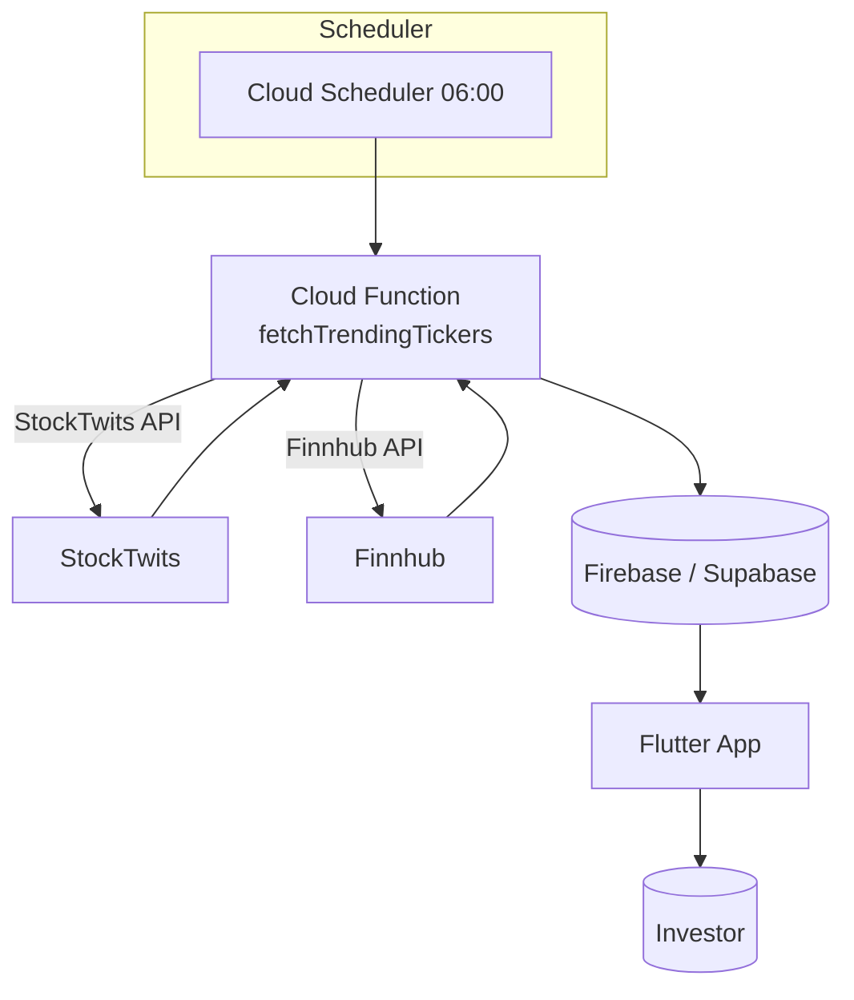

# today-meme-news

# 📰 today-meme-news

> "미국 밈 주식 커뮤니티의 열기를, 아침마다 한눈에"

**today‑meme‑news** 는 미국 주식 커뮤니티( Reddit / WallStreetBets / StockTwits 등)에서 전날 가장 많이 언급된 **밈 종목(티커)** 과 주요 이슈를 자동 수집하고, 대형 언어 모델(LLM)로 요약·감정 분석하여 **한국 사용자**에게 매일 아침 브리핑 형태로 전달하는 서비스입니다.

---

## 🧠 기획 의도

| Pain Point                             | Insight                             |
| -------------------------------------- | ----------------------------------- |
| 시차·언어 장벽으로 전날 미국 커뮤니티 이슈를 실시간 파악하기 어려움 | "아침 한 번 스크롤로 전날 밈 종목 트렌드 전체를 보고 싶다" |
| 뉴스는 많지만 커뮤니티 여론·감정 변화까지 보여주는 서비스 부족    | 밈·슬랭·감정까지 요약해 주면 **투자 판단 힌트**가 된다   |
| 시세 데이터 + 커뮤니티 데이터가 분리돼 있어 상관관계 파악 어려움  | "언급량 늘었는데 주가도 같이 움직였네"를 한 화면에!      |

---

## 🎯 핵심 기능 (MVP Scope)

1. **트렌딩 티커 추출**
   • StockTwits API `trending/symbols` 로 전날 핫티커 최대 10개 수집
2. **시세 데이터 연동**
   • Finnhub REST API로 **전일 종가·변동률** 가져오기
3. **콘텐츠 요약 & 감정 분석**
   • LLM(Gemini)으로 상위 멘션 30개 요약 + Sentiment 분류
4. **Firebase/Supabase 저장**
   • 매일 **06:00 KST** Cloud Functions(또는 Supabase Edge Function) 크론 실행
   • `trending` 컬렉션(날짜→티커→요약/감정/가격) 스키마로 저장
5. **Flutter 앱 UI**
   • 카드 뉴스 형태 피드
   • (+) / (–) 변동률 색상표시, 감정 이모지 ☺️ 😐 😡
6. **Push 알림**
   • FCM ‑ 아침 07:00 "오늘의 밈뉴스가 도착했어요!"

---

## 🔧 시스템 아키텍처



---

## 💡 데이터 모델 (firebase example)

```json
{
  "date": "2025-05-08",
  "tickers": {
    "TSLA": {
      "mentions": 2341,
      "sentiment": "positive",
      "summary": "Elon announced robo‑taxi, community hyped",
      "close": 184.31,
      "changePct": 3.27
    },
    "AMC": { ... }
  }
}
```

---

## 🖥️ 기술 스택

| Layer           | Tech                                               |
| --------------- | -------------------------------------------------- |
| **Data Ingest** | Cloud Functions (Node.js) / Supabase Edge Function |
| **APIs**        | StockTwits, Finnhub, Gemini (LLM)                  |
| **Database**    | Firebase Firestore **or** Supabase (PostgreSQL)    |
| **Client**      | Flutter (Dart)                                     |
| **Hosting**     | Firebase Hosting / Play Store & App Store          |

---

## 🚀 로드맵 (Backlog)

* [ ] 05‑15  StockTwits API 연동 모듈 완성
* [ ] 05‑18  Finnhub 가격 모듈 + Cron Function 배포
* [ ] 05‑20  Firestore 스키마 정의 & 데이터 파이프라인 테스트
* [ ] 05‑24  Flutter 피드 UI 프로토타입 완성
* [ ] 05‑28  FCM 알림 연동 및 베타 테스트 (내부 TestFlight)
* [ ] 06‑05  공개 베타 런칭 → 피드백 수집

---

## 📊 KPI (MVP 단계)

| 지표               | 목표   |
| ---------------- | ---- |
| 일평균 활성 사용자 (DAU) | 100명 |
| 브리핑 카드 평균 체류 시간  | 45초  |
| 클릭률(자세히 보기)      | 25%  |
| 1주 retention     | 40%  |

---

## 📄 라이선스

MIT License
데이터 원천(API)의 이용 약관을 준수하며, 상업적 전환 시 각 API 업체 정책을 재검토합니다.

---

## 📫 Contact

프로젝트 문의 / 협업 제안: **[gus20102@naver.com](mailto:gus20102@naver.com)**
© 2025 Son Young‑Hyun
